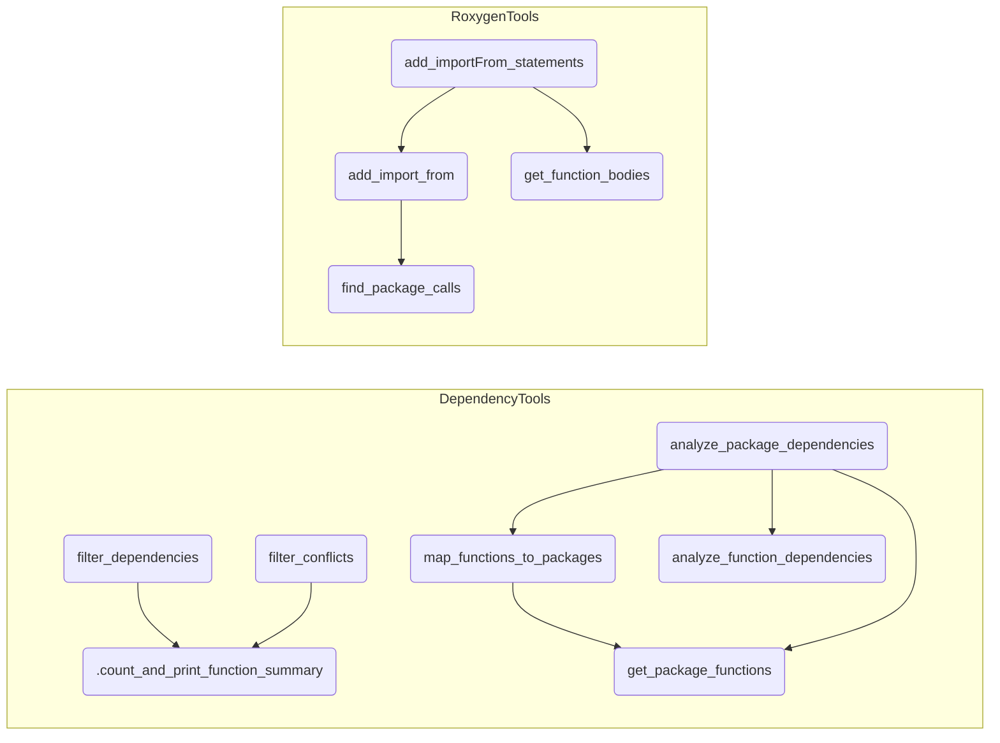

# PackageTools 
Functions and wrappers to manage R packages (creation, documentation, dependencies, checks).


[TOC]


# 1. PackageTools

## Overview

`PackageTools` is designed for parsing R function source files, specifically the extraction of function  documentation details from Roxygen comments. It offers two primary functions: `parse_roxygen_simple()` and the recommended `parse_roxygen()`. Both functions serve to automate the process of generating markdown documentation from Roxygen comments in R source files, streamlining the process of maintaining up-to-date documentation for R packages.

### `parse_roxygen_simple()`

- **Purpose**: Extracts basic information (function names, titles, and descriptions) from Roxygen comments in an R script and writes them to a markdown file.
- **Usage**: Intended for simpler R scripts where a quick summary of functions is needed.
- **Functionality**:
  - Reads an R script, identifying functions and their corresponding Roxygen comments.
  - Extracts function names, titles, and descriptions.
  - Handles discrepancies in the number of titles and descriptions.
  - Outputs the information in a structured markdown format.
  - Optionally opens the resulting markdown file automatically.

### `parse_roxygen()`

- **Purpose**: A more advanced version of `parse_roxygen_simple`, offering enhanced parsing capabilities and additional options for output customization.
- **Usage**: Suitable for more complex R scripts where detailed documentation is required.
- **Functionality**:
  - Parses Roxygen comments with greater depth, accommodating for descriptions spanning multiple lines.
  - Incorporates functionality to handle edge cases and possible parsing issues.
  - Provides options for including titles in the output and customizing the header level of function names in the markdown output.
  - Outputs a detailed markdown document with a list of functions, their titles, and descriptions.
  - Verifies the completeness of function extraction against the actual functions defined in the script.
  - Outputs an assertion to confirm the existence of the generated documentation file.

Both functions emphasize ease of use and automation in documentation generation, making them valuable tools for R developers looking to maintain clear and consistent documentation for their code. The script facilitates a more efficient workflow, especially beneficial in agile development environments where code changes are frequent, and documentation needs to be kept up-to-date with minimal effort.

The functions are designed to be run on R scripts with properly formatted Roxygen comments. Proper use of these tools can significantly reduce the manual effort involved in maintaining accurate and comprehensive documentation for R packages.


------------------------------

# 2. DependencyTools

`DependencyTools`, is the first fully working part of the R package `PackageTools` and it is designed to analyze and visualize **function-level dependencies** within and **across R packages**. It provides a suite of tools for extracting, filtering, and examining the intricate network of function calls, making it easier for developers and analysts to understand and manage code dependencies.

## Motivation

In complex R projects, understanding the relationships between different functions across various packages can be challenging. Dependencies are not always clear, leading to difficulties in maintenance, debugging, and optimization. DependencyTools addresses this challenge by providing a clear and comprehensive view of function dependencies, aiding in:

- Identifying redundant or conflicting functions.
- Understanding the impact of changes in one function on others.
- Streamlining package development and enhancing code quality.

## Installation

You can install DependencyTools from GitHub using the following command:

```R
# install.packages("devtools")
devtools::install_github("vertesy/PackageTools")
```

## Usage Example

Below is a detailed example of how to use DependencyTools to analyze function dependencies.

### Analyzing Dependencies

First, load the DependencyTools package:

```R
library(PackageTools)
```

#### Analyze dependencies in a set of R packages:

```R
packages <- c("dplyr", "ggplot2")
dependencies <- analyze_package_dependencies(packages)
```

This function will return a list where each element represents the dependencies of functions within the specified packages.

#### Analyze excluding specific packages and strings:

> Note: The `exclude_packages` option allows you to specify packages whose functions should not be considered as dependencies. The `exclude_strings` option lets you exclude any function whose name contains any of the specified strings. This is particularly useful for ignoring irrelevant or non-essential functions in the dependency analysis.

```R
packages <- c("CodeAndRoll2", "stringr")
exclude_pkg <- c("base", "stats") # Packages to exclude
exclude_str <- c("HYPERLINK", "Deprecated") # Strings to exclude

dependencies <- analyze_package_dependencies(packages, exclude_packages = exclude_pkg, exclude_strings = exclude_str)
```

This function will return a list where each element represents the dependencies of functions within the specified packages, excluding dependencies from the specified packages and functions whose names contain the specified strings.

### Filtering Dependencies

Filter out functions with no dependencies / only with dependencies:

```R
funs_with_deps <- filter_dependencies(dependencies, include_only_with_deps = TRUE)
funs_no_deps <- filter_dependencies(dependencies, include_only_with_deps = TRUE)
```

### Identifying Conflicts

Extract dependencies with conflicts:

```R
dep_conflicts <- filter_conflicts(dependencies)
```

### Expected Output

The output from `analyze_package_dependencies` will be a list structured as follows:

```R
$package_name
  $function_name
    [1] "package1::dep_function1" "package2::dep_function2"
```

For `filter_dependencies` and `filter_conflicts`, the output will be similar but filtered based on the criteria you set (presence of dependencies or conflicts).


------------------------------

# 3. RoxygenTools
`Currenly limited in scope`
## Goal: Adding @importFrom Statements to Roxygen

This R package provides functionality to automatically add `@importFrom` statements to the Roxygen documentation of functions in an R script. It scans for functions called using the `::` operator within function bodies and appends the corresponding `@importFrom` directives to the Roxygen blocks above the function definitions.


## Usage

To use the package, simply call the `add_importFrom_statements` function with the path to your R script. You can also specify a suffix for the `@importFrom` statements and a list of packages to exclude from processing.

`warning: add_importFrom_statements() overwrites your file, with the @importFrom statements added`

```R
# Example script path
script_path <- '~/path/to/your/my_functions.R'

# Exclude specific packages (optional) - not to add them to 
exclude_packages <- c("MarkdownReports")

# Add @importFrom statements
add_importFrom_statements(script_path, suffix = "ADDED_BY_add_importFrom_statements", exclude_packages = exclude_packages)

# Now open the file (ideally it's under git) and check each line containing the suffix.
```

After running this function, your R script will have `@importFrom` statements and `suffix` added to the Roxygen documentation of functions that use other packages' functions with the `::` operator.

They are not at the correct place, but easy to fix.


---


# 4. ReplacementTools.R

`Replace T and F with TRUE and FALSE in R Scripts.` This script contains a utility function for R scripts that **<u>safely</u>** replaces shorthand boolean representations (`T` and `F`) with their full representations (`TRUE` and `FALSE`). 

**Why Use This Function?** R allows `T` and `F` as shorthand for `TRUE` and `FALSE`. However, it's considered best practice to use `TRUE` and `FALSE` for clarity and to avoid accidental errors. The `T` and `F` are just regular objects in R that can be overwritten, which can lead to bugs if they are redefined unintentionally. This function helps in refactoring existing R scripts to replace these shorthands with their full representations.

## Features

- Safely replaces `T` and `F` with `TRUE` and `FALSE` in R scripts. **Still you have to manually check the results**!
- Offers a `strict_mode` to replace `T` and `F` only *when they are surrounded by specific characters or at the end of a line* (recommended, default).
- Customizable for different contexts through user-defined preceding and following characters.
- Useful for cleaning up and standardizing R scripts.

## Function Usage

### `replace_tf_with_true_false`

Replaces all instances of `T` and `F` in an R script with `TRUE` and `FALSE`, respectively.

#### Arguments

- `file_path`: Path to the R script file.
- `output_path`: Path where the modified script will be saved. Defaults to `file_path`.
- `strict_mode`: Logical; if `TRUE`, only replaces `T` and `F` that are surrounded by specified characters. Default is `TRUE`.
- `preceding_chars`: Characters that can precede `T` or `F`. Default is `"\\s"`.
- `following_chars`: Characters that can follow `T` or `F`. Default is `c(",", "\\)", "\\]")`.

#### Example

```R
replace_tf_with_true_false("path/to/original_script.R", "path/to/modified_script.R")
```


---------

# 5. DocumentationTools

This utility streamlines the process of setting up and maintaining R packages. It sources `configuration` details from a specified file and performs tasks like setting up package structure, backing up files, and updating citation information.

## Usage

To use this utility, place a `config.R` file in the `Development` subdirectory of your package's directory. Then call the `create_package` function with the path to your package.

### Creating a Package

```R
create_package("~/GitHub/Packages/YourPackageName", "config.R", update_citation = FALSE)
```

>  Set `update_citation` to `TRUE` if you have & want to update the CITATION file.


### Configuring Your Package

Create a `config.R` file with the following structure:

```R
config <- list(
  package.name = "YourPackageName",
  title = "Package Title",
  description = "Description of your package",
  version = "1.0.0",
  author.given = "YourFirstName",
  author.family = "YourLastName",
  author.email = "youremail@example.com",
  license = "LicenseType",
  depends = "Dependencies",
  imports = "Imports",
  bugReports = "https://github.com/yourusername/YourPackageName/issues"
)
```


---------------------------------------------------------------------------------------------------------

# List of Functions

### PackageTools.R (3) 

Updated: 2023/11/24 16:45

- #### 1 `parse_roxygen_simple()`

  Parse Roxygen Comments. Extracts and summarizes Roxygen documentation comments from a specified R script file.

- #### 2 `parse_roxygen()`


- #### 3 `.convertFilePathToOutput()`

  Convert File Path for Documentation. Converts a file path from an R script format to a markdown file format,


### DependencyTools.R (5) 

Updated: 2023/11/25 14:00

- #### 1 `get_package_functions()`

  Get Package Functions. Retrieves all function names from a specified package. 

- #### 2 `map_functions_to_packages()`

  Map Functions to Packages. Creates a mapping of functions to their source packages.               Optionally performs an extended search across all installed packages. 

- #### 3 `analyze_function_dependencies()`

  Analyze Function Dependencies with Exclusions. Analyzes dependencies of functions within a package, excluding specified packages and strings. 

- #### 4 `analyze_package_dependencies()`

  Analyze Package Dependencies. Analyzes and maps the dependencies of all functions in a set of packages. 

- #### 5 `filter_dependencies()`

  Filter Function Dependencies. Filters the function dependencies to either include only functions with dependencies               or only those without dependencies. 

- #### 6 `filter_conflicts()`

  Filter Out Conflict Dependencies. Filters the dependencies to extract only those with conflicts. 


## Function relationships

> (of connected functions)




> *created by `convert_igraph_to_mermaid()`*

# Contributing

Contributions to DependencyTools are welcome, please communicate via issues.

---


